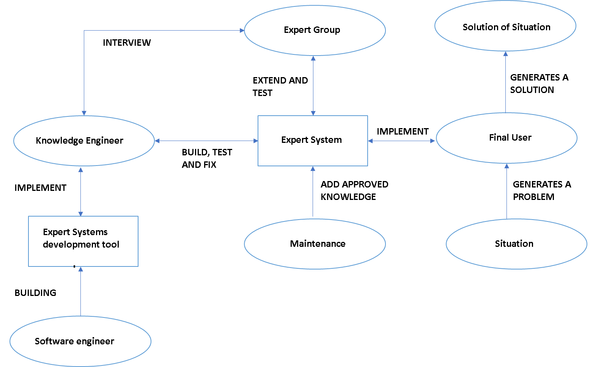
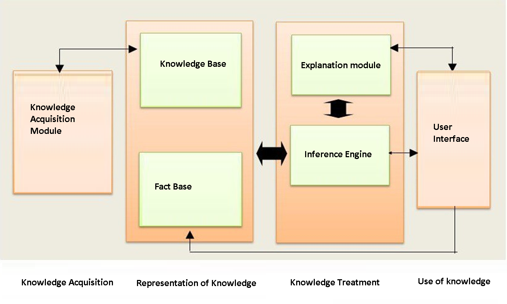
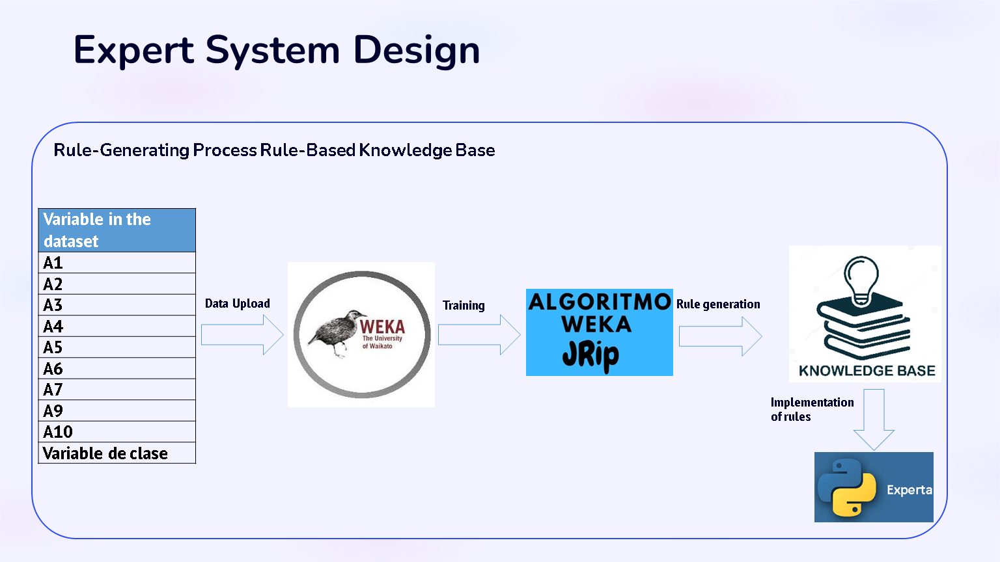
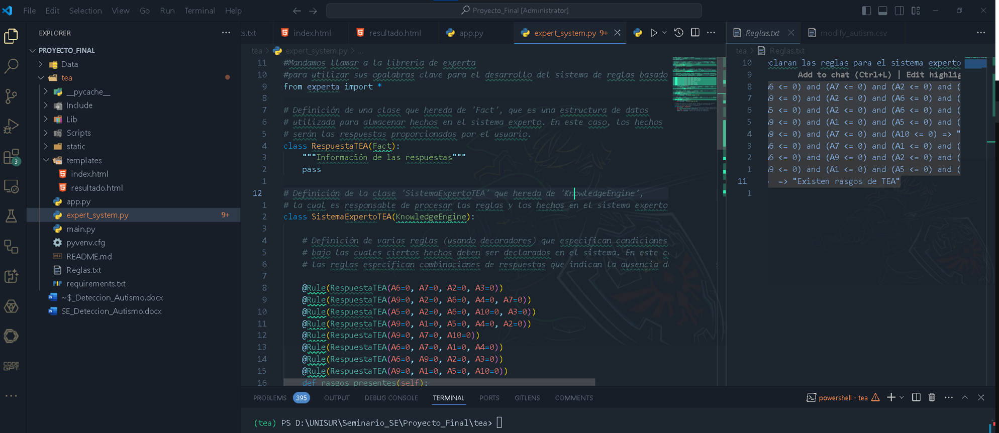
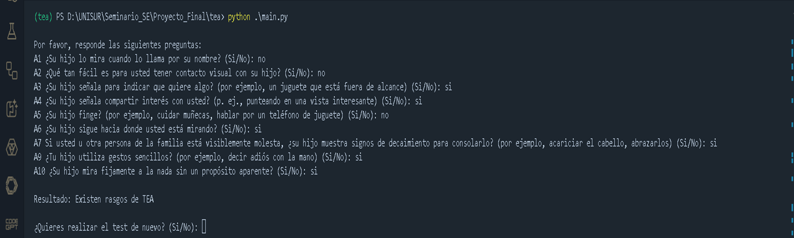
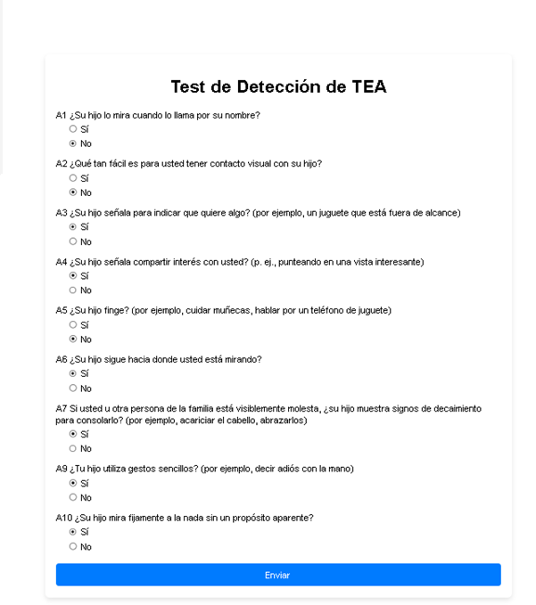

# Expert Systems as a tool for diagnosing autism spectrum disorder

## Context of the problem 

- Autism spectrum disorder (ASD) is a complex neurological condition that affects people's social development, communication, and behavior. 
- Due to the diversity of symptoms and the need for comprehensive evaluation, early diagnosis of ASD can be challenging for health professionals (Carmona-Serrano, 2020).
- Approximately 1.5% of the world's population suffers from ASD and is still misdiagnosed by child and adult psychiatrists and sometimes even confused with other neurodevelopmental conditions that have similar characteristics (Fusar-Poli, 2020). 
- There is still no focused laboratory test to help healthcare personnel diagnose the condition 100% and there is no pharmacological treatment for ASD (Carmona-Serrano, 2020). 
- Mobile and system applications have proven to be support tools for ASD detection (Adamu, 2019). 

## Problem to be solved

In this context, the main problem to be solved is the development of a system that supports the ASD detection process. Currently, this process can be lengthy, expensive, and often depends on the experience and knowledge of the medical staff. The development of an expert system that integrates the knowledge of an expert in the field of ASD to aid in the early detection of ASD and is a support tool for health professionals.

## General Objective 

To develop an expert system based on artificial intelligence that facilitates the early detection of ASD and is a support tool for health professionals by integrating knowledge from an expert in the field.

## Justification

- Early detection: ASD is a neurodevelopmental disorder that affects people from childhood to adulthood. Therefore, early detection of ASD is important to be able to develop effective interventions by medical specialists (psychiatrists, psychologists, neurologists) that can help improve the patient's quality of life.
  
- Cost and Time: Traditional diagnostic methods, such as the DSM-5 criteria, the Childhood Autism Rating Scale (CARS), and autistic behavior interviews, are expensive and time-consuming, limiting patient accessibility, especially in low- and middle-income families.
  
- Lack of specialists: the lack of specialists in the early diagnosis of ASD makes the problem complex, since the patient does not receive a timely and/or favorable diagnosis, and this results in late interventions, which can influence the development of the patient's quality of life.
  
- Uncertainty in diagnosis: Factors related to autism, such as social interaction, communication, and behavior, cannot be measured with absolute certainty due to the vagueness and imprecision of the information. This makes traditional diagnoses less accurate.

## Expert System Functionality

- Data Collection The expert system will collect information about the patient's medical history, the results of behavioral assessments, and caregiver reports. This information will be used as an input for the diagnostic process.

- Data Analysis Using artificial intelligence techniques, the system will analyze the collected data to identify characteristics that may indicate the detection of ASD. This will include the use of artificial intelligence algorithms from expert systems.

- Diagnosis and Recommendations Based on the analysis of the data, the expert system will generate a report on the detection of ASD.

## Expert System Design

### BRB Architecture 

User Interface It is what facilitates communication between the user and the inference engine. It allows you to enter information for the system and communicate to the user the answers of the E.S.

Explanation Module Explains the steps taken by the inference engine to reach conclusions, justifying the actions (why it uses certain rules).

- Inference Engine: It is the section of the S.E that performs the inference processes that relate the information contained in the working memory with the knowledge base, in order to draw conclusions.

- Fact Base: Auxiliary memory that contains information about the problem to be solved (initial data) and the state of the system throughout the inference process (intermediate data).

- Knowledge Base: It has information about the domain of knowledge to which the expert system refers. It contains declarative knowledge (facts) and procedural knowledge (rules).

- Knowledge Acquisition Module: Facilitates the entry of knowledge into the database and inference mechanisms into the inference engine.  It validates the veracity and coherence of the facts and rules that are introduced.

## Expert Development of the Knowledge Base

## Expert Implementation of the Knowledge Base

## Expert Execution of the Knowledge Base

## Reflections

### What was most difficult for you about the whole project?

The most complicated thing was to choose the appropriate algorithm that adapted to the solution of the problem raised, I was reviewing several articles that helped me to give me an idea that it had been implemented before, I found expert systems based on the system based on rules, fuzzy logic, decision trees, vector support machine and based on rules of belief. Each algorithm has its strengths and weaknesses, and may require extensive testing to determine which one is the most effective. However, within the literature exposed I was able to identify the use of the rule-based algorithm and a limitation was to generate the rules manually since they could not give the satisfactory and expected result, so when I found the WAKA tool I made the decision to use JRip (RIPPER) and thus generate the rules based on validation parameters of the rules.

### What did you get the most out of the whole project?

Having the way to generate the rules, what was easier for me was the implementation of the rules in the Python Expert tool, since when reviewing the syntax of how to make the expert system in this library it was easy for me to understand, due to the previous experience I have developing applications with Python and then configuring the Flask tool for the design and implementation of the web form to make it more accessible to the user.

### What is your opinion of the role that expert systems play in the future?

In my opinion, I believe that expert systems have a great disadvantage compared to other areas of artificial intelligence, due to the limitation of being able to expand knowledge and that it is not expensive to develop it regardless of the implementation tool, so, in scientific articles that I read and what was developed in the prototype,  Its future is integration with other AI technologies, such as machine learning and natural language processing. This integration will allow expert systems to adapt and learn continuously, improving their ability to make decisions in more complex contexts.

### What alternatives exist today to the use of expert systems?

There are currently several alternatives and approaches that can complement or replace the use of traditional expert systems. These alternatives can be:

- Machine Learning: Machine learning allows systems to learn patterns from data. 

- Deep Learning: Using deep neural networks, it has shown outstanding results in areas such as speech and image recognition, machine translation, and more.

- Natural Language Processing allows machines to understand and generate human language. 

- Generative AI is a type of artificial intelligence designed to generate new content from existing data. 

## System Improvement

### Autism severity rating 

- The system can be improved for the detection of ASD severity based on the DSM 4 and DSM 5 criteria. 

- Data analysis is performed with a machine learning algorithm.

- Being able to use the Synthetic Minority Oversampling Technique (SMOTE) to correct the problem of attribute imbalance that may exist in the dataset. 

- Avoid uncertainty in patient responses by building the knowledge base in the BRBES belief rules-based system.

- Have a large amount of data in this field of study through artificial intelligence techniques, since most of the applications developed rely on literature and the human expert to obtain data. 

## Conclusion

### Improved Diagnosis

The development of an expert rule-based system for the detection of ASD in children was presented. This expert system handles basic rule bases, but other algorithms such as BRBES, Linear Regression, ANN, Random Forest and Decision Tree can be explored using ROC curves to evaluate their accuracy. 

### Accessibility and Scalability

The results show that the expert system works stably but its full operation is not yet validated, since the use in a real situation can provide relevant information that gives a percentage of validation that so many patients can be detected with features of ASD. 

### Continuous Learning

Therefore, it is necessary to broaden and deepen the issue of algorithms that help improve the base system and thus be able to have a higher degree of percentage than what occurs in traditional methods of detection of ASD. 

## Bibliography
- Adamu, A. S., Abdullahi, S. E., & Aminu, R. K. (2019). A survey on software applications use in therapy for autistic children.  2019 15th International Conference on Electronics, Computer and Computation, ICECCO 2019, 1–4. https://doi.org/10.1109/ICECCO48375.2019.9043237

- Cao, Y., Zhou, Z. J., Hu, C. H., Tang, S. W., & Wang, J. (2021). A new approximate belief rule base expert system for complex system modelling. Decision Support [ ̈*] Systems, 150, 113558. https://doi.org/10.1016/j.dss.2021.113558

- Carmona-Serrano, N., López-Belmonte, J., López-Núñez, J. A., & Moreno-Guerrero, A. J. (2020). Trends in autism research in the field of education in web of science: A bibliometric study. Brain Sciences, 10(12), 1–22.  https://doi.org/10.3390/brainsci10121018

- Fusar-Poli, L., Brondino, N., Politi, P., & Aguglia, E. (2020). Missed diagnoses and misdiagnoses of adults with autism spectrum disorder. European Archives of Psychiatry and Clinical Neuroscience. https://doi.org/10.1007/s00406-020-01189-w

- Isa, N. R. M., Yusoff, M., Khalid, N. E., et al. (2014). Autism severity level detection using fuzzy expert system. 2014 IEEE International Symposium on Robotics and Manufacturing Automation, 218.

- Thabtah, F., Kamalov, F., & Rajab, K. (2018). A new computational intelligence approach to detect autistic features for autism screening. International Journal of Medical Informatics, 117, 112–124.Thabtah, F., & Peebles, D. (2019). A new machine learning model based on induction of rules for autism detection. Health Informatics Journal, 26, 264-286.

- Adarraga, P., & Zaccagnini, J. L. (1992). DAI: A knowledge-based system for diagnosing autism: A case study on the application of artificial intelligence to psychology. European Journal of Psychological Assessment, 8(1), 25–46.

- Alharbi, S. T., Hossain, M. S., & Monrat, A. A. (2015). A Belief Rule Based Expert System to Assess Autism under Uncertainty. Proceedings of the World Congress on Engineering and Computer Science, 41(3), 21–23. https://doi.org/10.1007/s10916-017-0685-8

- Al-Wahaibi, A., Al-Hajry, M., Al-Bahrani, Z., & Al-Busaidi, K. A. (2016). The Development and Acceptance of Autism Advisory Expert System. International Journal of Computing and Information Sciences, 12(2), 179–188. https://doi.org/10.21700/ijcis.2016.121

- Blanchet, B. (2001, June). An efficient cryptographic protocol verifier based on prolog rules. In CSFW (Vol. 1, pp. 82-96).

- Isa, N. R. M., Yusoff, M., Khalid, N. E., Tahir, N., & Binti Nikmat, A. W. (2015). Autism severity level detection using fuzzy expert system. 2014 IEEE International Symposium on Robotics and Manufacturing Automation, IEEE-ROMA2014, 218–223. https://doi.org/10.1109/ROMA.2014.7295891

- Kok, K., Derzsi, Z., Gordijn, J., Hommelberg, M., Warmer, C., Kamphuis, R., & Akkermans, H. (2008, January). Agent-based electricity balancing with distributed energy resources, a multiperspective case study. In Proceedings of the 41st Annual Hawaii International Conference on System Sciences (HICSS 2008) (pp. 173-173). IEEE.

- Lialiou, P., Zikos, D., & Mantas, J. (2012). Development and evaluation of an expert system for the diagnosis of child autism. Studies in Health Technology and Informatics, 180, 1185–1187. https://doi.org/10.3233/978-1-61499-101-4-1185

- Mahmoudi, M., & Akbari-zardkhaneh, S. (2015). Developing Autism Screening Expert System (ASES). AWERProducedia Information Technology & Computer Science, 2013 (January).

- Merritt, D. (2012). Building expert systems in Prolog. Springer Science & Business Media.

- Mizoguchi, F. (1983). PROLOG based expert system. New Generation Computing, 1(1), 99-104.

- Sajjad, S., Qamar, H., Tariq, K., & Bano, S. (2011). Development of a diagnostic expert system for autism disorder- PCADEX. Proceedings of the 2011 International Conference on Artificial Intelligence, ICAI 2011, 2(May), 934–938.

- Singla, J. (2013). The diagnosis of some lung diseases in a prolog expert system. International Journal of Computer Applications, 78(15).

- Yuan, J., Holtz, C., Smith, T., & Luo, J. (2016). Autism spectrum disorder detection from semi-structured and unstructured medical data. Eurasip Journal on Bioinformatics and Systems Biology, 2017(1), 1–9. https://doi.org/10.1186/s13637-017-0057-1

- Yulianto, T., Andryana, S., & Gunaryati, A. (2019). Expert System For Autism Prediction In Children With Web-Based Forward Chaining Method. Jurnal Mantik, 3(4), 522–530.

- Alharbi, S. T., Hossain, M. S., & Monrat, A. A. (2015). A belief rule based expert system to assess autism under uncertainty. Proceedings of the World Congress on Engineering and Computer Science 2015, 41(3), 21–23. https://doi.org/10.1007/s10916-017-0685-8

- Gnanaprasanambikai, L. (2017). Performance analysis of RIPPER algorithm using WEKA tool. International Journal of Advanced Research in Computer Science and Software Engineering, 7(5), 55–57.

- Hall, M., Frank, E., Holmes, G., Pfahringer, B., Reutemann, P., & Witten, I. H. (2009). The WEKA data mining software: An update. ACM SIGKDD Explorations Newsletter, 11(1), 10–18. https://doi.org/10.1145/1656274.1656278

